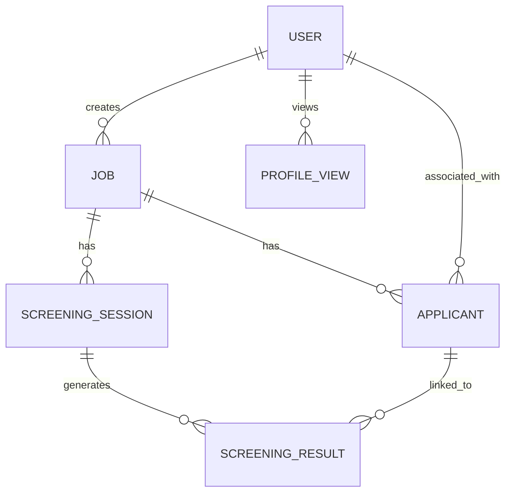

# Database Schema

This document outlines the MongoDB data models used in the platform, managed via Mongoose.

## Core Models

### 1. User (`User.ts`)
Represents both recruiters (company) and applicants (talent).
- **email**: Unique user email.
- **password**: Hashed password (Bcrypt).
- **role**: Either `talent` or `company`.
- **profile**:
    - **name**, **phone**, **bio**.
    - **company**, **position** (if role is `company`).
    - **skills**, **experience**, **education** (if role is `talent`).
    - **profileCompletion**: Percentage of profile completed (0-100).
- **isVerified**: Account verification status.

---

### 2. Job (`Job.ts`)
Represents a job posting created by a company.
- **companyId**: Reference to the User (company role).
- **title**: Job title.
- **description**: Full job description.
- **employmentType**: Full-time, Part-time, Contract, Freelance.
- **workMode**: Remote, Hybrid, On-site.
- **requirements**:
    - **skills**: Array of required skills.
    - **experience**: Min/max years.
    - **education**: Required degree(s).
- **weights**: 
    - **skills**, **experience**, **education**, **relevance** (Decimals totaling 1.0).
- **status**: `draft`, `active`, `closed`.

---

### 3. Applicant (`Applicant.ts`)
Represents a candidate linked to a specific job.
- **jobId**: Reference to the Job model.
- **userId**: Optional reference to a User (talent role) if imported.
- **profile**:
    - **name**, **email**, **phone**, **skills**, **experience**, **education**, **summary**.
- **source**: `upload` (from file) or `import` (from Umurava platform).
- **cvUrl**: Optional link to the uploaded resume.
- **appliedAt**: Timestamp of application/ingestion.

---

### 4. ScreeningSession (`ScreeningSession.ts`)
Tracks the progress of an AI screening session for a job.
- **jobId**: Reference to the Job model.
- **status**: `pending`, `processing`, `completed`, `failed`.
- **progress**: (processedApplicants / totalApplicants) * 100.
- **resultsCount**: Number of candidates successfully screened.
- **error**: Optional error message if the session failed.

---

### 5. ScreeningResult (`ScreeningResult.ts`)
Stores the detailed AI evaluation for an applicant.
- **sessionId**: Reference to the ScreeningSession.
- **jobId**: Reference to the Job model.
- **applicantId**: Reference to the Applicant model.
- **rank**: Integer rank among all applicants for this job.
- **matchScore**: Overall suitability score (0-100).
- **scoreBreakdown**:
    - **skills**, **experience**, **education**, **relevance** (Individual scores).
- **evaluation**:
    - **strengths**, **gaps**, **risks** (Arrays of insights).
    - **recommendation**: `highly_recommended`, `recommended`, etc.
    - **reasoning**: AI-generated textual justification.

---

### 6. ProfileView (`ProfileView.ts`)
Tracks recruiter engagement with talent profiles.
- **talentId**: User ID of the talent being viewed.
- **companyId**: User ID of the recruiter viewing the profile.
- **viewedAt**: Timestamp of the view.

---

## Model Relationships

